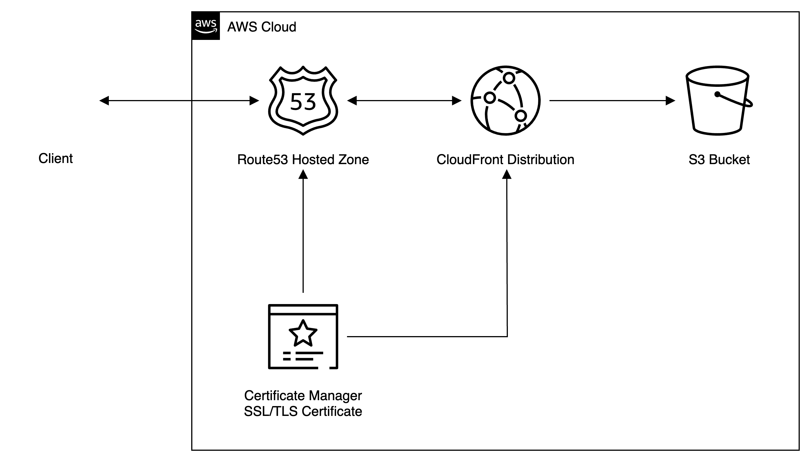

# Secure Static Website using AWS

Creates a static site with a custom domain in Route53 validated with a SSL/TLS certificate. This solution also utilizes OriginAccessControl and a bucket policy to grant the cloudfront distrubution access to your S3 bucket without making it publicly available.

Since CloudFront is in the global region, the certificate can only be created in `us-east-1` for this to work. TBD on if I can get a solution to work cross-region

## Prerequisites

- An AWS account (with MFA enabled strongly recommended).
- An IAM Role that grants the minimum required permissions to manage these AWS resources.
- Domain registered via Route53
- A Hosted Zone that matches `var.domain`
- terraform cli v1.9 or greater
- aws cli v2
- aws credentials configured via `aws configure`

## Deploying

Simply run `terraform apply` in the terminal in the repo directory!

Once the S3 bucket is created, simply upload your site files to the root of the bucket and wait terraform to complete applying.
